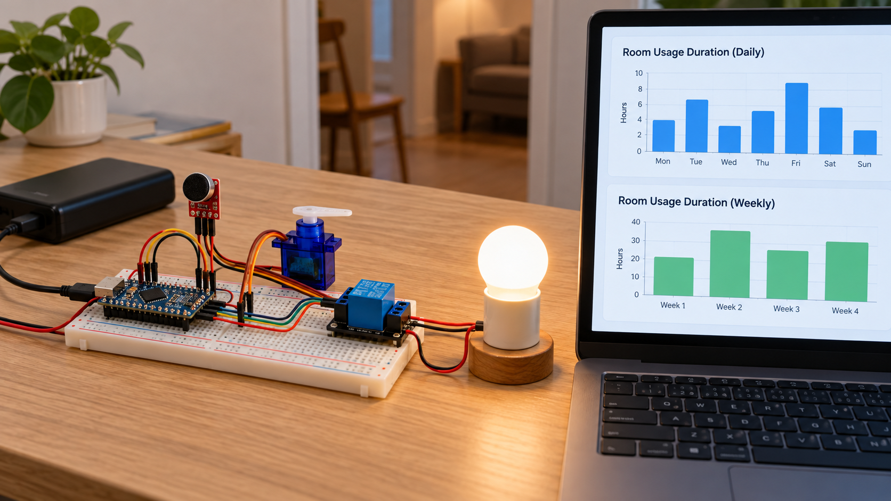
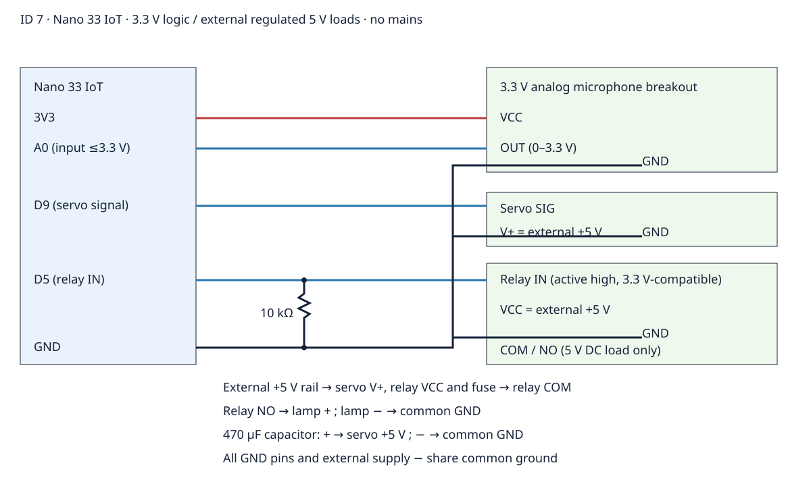

# Room Climate Hub Usage Analytics
Roadmap ID 7 — an Arduino Nano 33 IoT educational prototype that measures active time of a low-voltage ventilation demonstrator, counts starts, and summarizes daily and weekly use.


The illustration is conceptual; use the exact editable [circuit SVG](docs/circuit-diagram.svg) for assembly.

## Objectives and features
Learn component-specific IO, amplitude detection, safe actuator wiring, duration accounting and MQTT telemetry. A microphone peak-to-peak signal holds activity for five seconds; a servo moves between 0° and 90° and a relay switches a 5 V lamp. Optional MQTT on/off requests complement sound activation. Serial operation works without networking. The laptop charts in the illustration are conceptual; this repository emits summary JSON.

## Architecture and platform
Nano 33 IoT (SAMD21, 3.3 V logic). Every second, firmware samples 128 ADC readings, computes amplitude, then updates the activity policy. A pure C++ Usage class accounts the previous output state across elapsed intervals, splitting day/week boundaries. Day/week values are 24-hour/seven-day uptime windows, not calendar time. A 64-bit accumulated uptime tolerates millis wrap provided the loop runs at least once per 49.7 days. RAM-only counters reset on reboot. WiFiNINA connects to a user-provided LAN MQTT broker; no cloud service is required.

## BOM quantities
| Item | Quantity | Specification |
|---|---:|---|
| Arduino Nano 33 IoT | 1 | 3.3 V logic |
| Analog electret microphone breakout | 1 | 3.3 V VCC, OUT within 0–3.3 V |
| Hobby servo | 1 | 5 V power, accepts 3.3 V signal |
| Relay module | 1 | Active-high 3.3 V-compatible IN, 5 V VCC |
| DC lamp | 1 | 5 V, within relay contact rating |
| Regulated external supply | 1 | 5 V, rated for servo stall + relay + lamp |
| Capacitor | 1 | 470 µF, ≥10 V |
| Pull-down resistor | 1 | 10 kΩ |
| Fuse, breadboard and jumpers | 1 set | Fuse matched to load and wire rating |

## Prerequisites
Python 3.12, PlatformIO Core 6.1.18, a USB data cable, and optionally an MQTT broker reachable on the trusted LAN. Pinned dependencies are in platformio.ini.

## Exact pin map and circuit
| Nano / supply | Component pin |
|---|---|
| 3V3 | microphone VCC |
| A0 | microphone OUT |
| D9 | servo SIG |
| D5 | relay IN |
| GND | microphone GND, servo GND, relay GND, external supply − and lamp − |
| External +5 V | servo V+, relay VCC, fused relay COM |
| Relay NO | lamp + |


See [wiring](docs/wiring.md). Add 10 kΩ IN-to-GND and 470 µF across the servo supply. Never power servo or relay from Nano 3V3. Do not join external +5 V to Nano 3V3.

## Assembly and domain safety
Disconnect all supplies. Fit the pull-down and capacitor with correct polarity. Check continuity, common ground and module IO ratings before applying power. Test logic with the lamp disconnected, then connect the fused lamp circuit. Use low-voltage loads only; no mains, HVAC, locks, life-safety or security equipment. Keep fingers away from the servo. This microphone measures amplitude, not speech or calibrated sound pressure.

## Setup and flashing
```sh
python -m pip install platformio==6.1.18
pio run -e nano_33_iot
pio run -e nano_33_iot -t upload
pio device monitor -b 115200
```
Clone room-climate-hub-usage-analytics before running these commands from its root.

## Configuration
Defaults in firmware/room-climate-hub-usage-analytics/config.h leave networking off. Create an ignored config.private.h beside it to define WIFI_SSID, WIFI_PASSWORD and MQTT_HOST privately. Never commit actual credentials. SOUND_THRESHOLD defaults to 150 peak-to-peak 10-bit ADC units, not decibels. MQTT uses port 1883 without TLS or authentication; isolate it to a trusted LAN. Only one device with client ID omp-007 should connect at once. Network connection attempts can briefly block; this is not a real-time safety controller.

## Usage, telemetry and expected output
Serial emits one JSON record per second. MQTT publishes to omp/007/telemetry and accepts exact lowercase on/off at omp/007/command. On persists until off or reboot; off clears only that request, and sound can still hold activity for five seconds.
Fields: project_id, day, week, daily_ms, weekly_ms, events, sound_peak_to_peak, active. See [synthetic sample](sample-data/example.json). active time grows only while the previous output was active; a continuous activity episode counts once. Midnight-equivalent uptime rollover clears daily counters; seven-day rollover clears weekly active time. Events counts starts in the current uptime day, not occupied samples. Timing resolution is approximately one second.

## Tests and actual results
[Cloud validation results](docs/validation-results.md) records observed results; pending jobs are never reported as passed. Host assertions cover transition counting, boundary splits, weekly rotation and timer-wrap accumulation. Image transport tests reject corrupt PNGs and invalid base64. Completion checks verify PNG signature/CRC/dimensions/hash, SVG, relative links, MIT license and credential patterns. Board compilation targets the actual Nano 33 IoT.
```sh
g++ -std=c++17 tests/analytics_test.cpp -o /tmp/analytics && /tmp/analytics
python -m unittest discover -s tests
python tools/validate.py
python tools/validate_completion.py
pio run -e nano_33_iot
```
No physical hardware testing has been performed. Follow the manual checks in [test plan](docs/test-plan.md) before use.

## Troubleshooting
No serial: check USB data cable and 115200 baud. No MQTT: check private config, broker IP, port and client ID collision. Constant activity: inspect microphone bias/supply and raise threshold. Reboots when servo moves: size external power for stall current and verify common ground/capacitor. Inverted relay: use the specified active-high module. Counter reset: RAM-only storage resets on every reboot.

## Limitations and future work
No RTC/calendar alignment, durable counters, calibrated energy measurement, speech recognition, microphone fault diagnosis or production reliability claims. Add persistent storage, RTC/NTP, authenticated TLS transport, reconnect watchdog and a web chart consumer. Hardware validation and electrical design review remain necessary.

## Contributing and license
Provide reproducible telemetry, board version and wiring with an issue. Run host and board checks before opening a PR. MIT — see [LICENSE](LICENSE).
